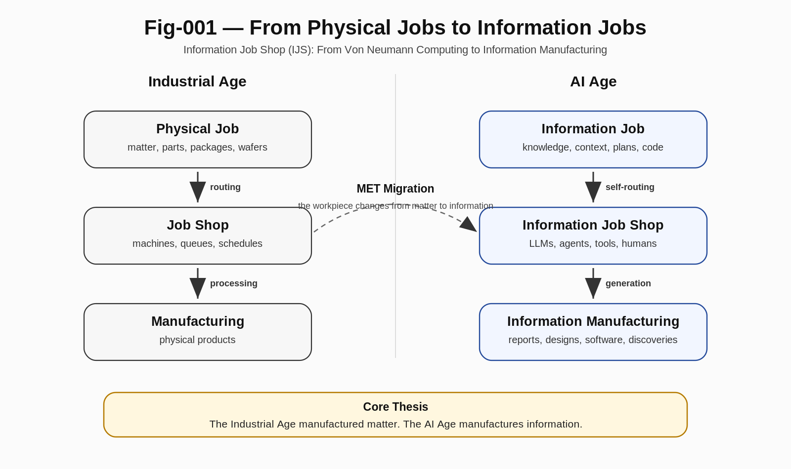

# 001 — Why Information Becomes the Job

> *The Industrial Age manufactured physical products. The AI Age is beginning to manufacture information.*

---

# Introduction

For more than seventy years, modern computing has been largely understood through the Von Neumann paradigm: instructions operate on data, producing new data.

This abstraction has been extraordinarily successful. It enabled operating systems, databases, the Internet, cloud computing, and modern AI.

However, recent developments in large language models (LLMs), AI agents, workflow systems, multi-agent collaboration, and human-AI cooperative environments suggest that the primary computational object is gradually changing.

The next computational workpiece is no longer simply data.

It is **information itself**.

This repository proposes the concept of an **Information Job Shop (IJS)** as a new engineering perspective for understanding this transition.

---

---

# From Physical Jobs to Information Jobs

Manufacturing systems organize production around **jobs**.

A job represents a workpiece together with its processing requirements.

Traditional Job Shop Scheduling studies how physical jobs travel through different machines according to their required processing routes.

Examples include:

- Automobile manufacturing
- Semiconductor fabrication
- CNC machining
- Warehouse logistics
- Order fulfillment

In all these systems:

> The workpiece is physical.

The machines process matter.

---

Modern AI systems introduce a fundamentally different situation.

The workpiece is no longer steel, silicon wafers, or packages.

Instead, the workpiece becomes:

- Information
- Knowledge
- Reasoning states
- Context
- Plans
- Reports
- Software artifacts
- Scientific hypotheses
- Design documents

In other words,

> **Information itself becomes the Job.**

This seemingly simple change has profound consequences.

---

# Why This Is a Paradigm Shift

Once information becomes the workpiece, computation is no longer merely executing instructions.

Instead, computation increasingly resembles an intelligent manufacturing system that continuously processes, transforms, assembles, verifies, and generates information.

This shift naturally introduces concepts already familiar in manufacturing engineering:

- Job routing
- Scheduling
- Dispatching
- Processing stations
- Quality assurance
- Production pipelines
- Resource allocation

The difference is remarkably small but fundamentally important:

Industrial manufacturing processes **physical jobs**.

Information Job Shops process **information jobs**.

---

# Information Is Not Passive

Unlike physical workpieces, information possesses unique computational characteristics.

An Information Job may:

- generate new subtasks,
- modify its own processing route,
- request additional information,
- invoke computational tools,
- interact with humans,
- interact with other information jobs,
- adapt to runtime feedback,
- continuously refine its own objectives.

Therefore,

> **An Information Job is an active computational entity rather than a passive workpiece.**

This distinction fundamentally separates Information Job Shops from traditional manufacturing systems.

---

# Toward Information Manufacturing

Modern AI systems already exhibit many characteristics of Information Job Shops.

LLMs generate prompts for subsequent processing.

Agents invoke tools.

Workflow systems dynamically determine execution paths.

Human-AI teams collaboratively manufacture reports, software, scientific discoveries, and engineering designs.

These developments suggest that computing is gradually evolving from:

> Instruction Processing

toward

> Information Manufacturing.

The purpose of this repository is not to present a complete theory.

Instead, it proposes a new engineering question:

> **What happens when information itself becomes the workpiece of computation?**

We believe this simple question may provide a useful conceptual foundation for the next generation of AI systems, computational architectures, and human-AI collaborative environments.

---

# Key Takeaways

- Computing is gradually shifting from instruction execution toward information manufacturing.
- The fundamental computational workpiece is evolving from data to information.
- Information Jobs differ fundamentally from physical jobs because they are active, adaptive, and capable of influencing their own processing routes.
- Information Job Shops provide a natural engineering framework for understanding AI agents, workflows, human-AI collaboration, and future computational systems.
- This repository introduces Information Job Shop (IJS) as an engineering paradigm intended to stimulate further exploration rather than provide a final theory.

---

*"The Industrial Age manufactured matter. The AI Age manufactures information."*