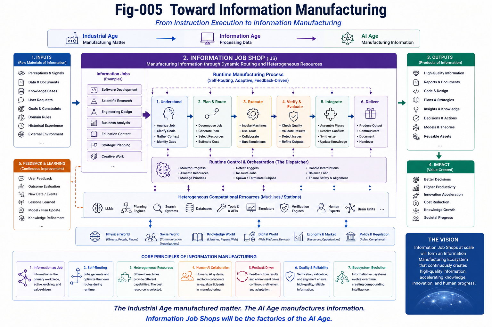

# 005 — Toward Information Manufacturing

> *The Industrial Age transformed civilization by manufacturing matter. The AI Age may transform civilization by manufacturing information.*

---

# Introduction

Industrial civilization was built upon manufacturing.

Factories transformed raw materials into products.

Production systems transformed isolated craftsmanship into scalable engineering.

Job Shops transformed fixed production lines into flexible manufacturing.

The next transformation may occur not in the physical world,

but in the informational world.

Instead of manufacturing physical products,

future computational systems may manufacture information.

Information Job Shop (IJS) represents one possible engineering framework for understanding this transition.

---

---

# Beyond Instruction Execution

For decades,

computing has primarily been viewed as instruction execution.

Programs execute instructions.

Processors execute programs.

Operating systems schedule processes.

This paradigm remains fundamental.

However,

modern AI systems increasingly spend their computational effort not on executing isolated instructions,

but on manufacturing increasingly valuable information.

Information itself becomes the primary product.

---

# Manufacturing Information

Information Manufacturing differs fundamentally from conventional computation.

Its products include:

- software systems,
- scientific discoveries,
- engineering designs,
- educational materials,
- medical analyses,
- legal reasoning,
- strategic plans,
- creative works,
- organizational knowledge.

Unlike ordinary data processing,

Information Manufacturing continuously improves the quality, completeness, consistency, and usefulness of information.

Its objective is not simply producing outputs.

Its objective is producing increasingly reliable knowledge.

---

# Information Manufacturing Systems

Future Information Manufacturing systems may contain many specialized processing resources.

Examples include:

- Language Models
- Planning Engines
- Verification Engines
- Search Systems
- Simulation Systems
- Scientific Solvers
- Design Engines
- Human Experts
- Specialized Brain Units

These heterogeneous processors cooperate on Information Jobs according to dynamically evolving runtime workflows.

The Information Job Shop therefore becomes an adaptive manufacturing ecosystem rather than a fixed computational pipeline.

---

# Human-AI Manufacturing

Industrial manufacturing combined workers, machines, logistics, and management.

Information Manufacturing naturally combines:

- humans,
- AI systems,
- computational tools,
- autonomous agents,
- specialized reasoning units,
- shared knowledge bases.

Each contributes different capabilities.

Rather than replacing human intelligence,

Information Manufacturing expands the productive capacity of both humans and AI.

Human-AI Tables therefore become collaborative Information Manufacturing environments.

---

# An Evolving Information Ecosystem

Unlike traditional factories,

Information Manufacturing systems continuously interact with their environment.

Information Jobs:

- receive feedback,
- generate new questions,
- revise previous conclusions,
- cooperate with other Information Jobs,
- compete for computational resources,
- adapt to changing conditions,
- manufacture increasingly valuable information.

Consequently,

an Information Job Shop naturally evolves into an

> **Information Manufacturing Ecosystem.**

Information manufacturing therefore becomes an ongoing evolutionary process rather than a finite production sequence.

---

# Toward Future Computing

Many emerging computational technologies can be viewed as early components of Information Manufacturing.

Examples include:

- AI Agents
- Runtime Planning
- Multi-Agent Systems
- Human-AI Collaboration
- Brain Units
- Tool Calling
- Knowledge Graphs
- Workflow Systems

These technologies should not necessarily be viewed as isolated innovations.

Instead,

they may represent different manufacturing resources participating in increasingly sophisticated Information Job Shops.

---

# Beyond the Von Neumann Era

The Von Neumann architecture established the computational foundation of the Information Age.

Information Job Shop does not replace this foundation.

Instead,

it proposes a higher organizational layer.

Instructions remain necessary.

Processors remain necessary.

Operating systems remain necessary.

However,

future computational systems may increasingly organize these resources around Information Jobs rather than isolated instruction streams.

The architectural focus gradually shifts:

From

> **Instruction Execution**

toward

> **Information Manufacturing.**

---

# Conclusion

This repository does not attempt to complete the theory of Information Job Shops.

Instead,

its purpose is to introduce a new engineering question.

Once information itself becomes the primary computational workpiece,

a new family of computational architectures naturally follows.

Future research may explore:

- Information Operating Systems
- Information Compilers
- Information Manufacturing Cells
- Information Logistics
- Information Warehouses
- Information Quality Assurance
- Information Supply Chains
- Information Manufacturing Metrics
- Information Manufacturing Economics

Information Job Shop is therefore proposed not as a finished theory,

but as an engineering starting point.

---

# Key Takeaways

- Information Manufacturing extends industrial manufacturing into the computational world.
- Information becomes both the workpiece and the product.
- Information Job Shops organize heterogeneous computational resources around Information Jobs.
- Human-AI collaboration naturally becomes Information Manufacturing.
- Future computing may gradually evolve from instruction-centric execution toward information-centric manufacturing.
- Information Job Shop is intended as an engineering paradigm for future exploration rather than a complete architectural specification.

---

*"The Industrial Age manufactured matter. The AI Age manufactures information. The next chapter of computing may therefore be written not by faster processors alone, but by better Information Job Shops."*