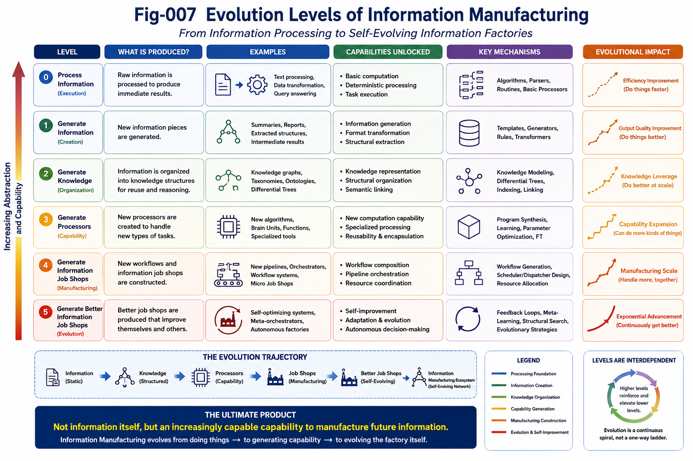

# IJS-011 — Autonomous Information Job Shop Evolution (AIJSE): From Information Manufacturing to Self-Evolving Information Factories

## Abstract

Traditional manufacturing job shops transform physical materials into finished products through a sequence of machines and operations. Their workflows are largely predetermined, and the manufactured products rarely influence the manufacturing system itself.

Information Job Shops (IJS) are fundamentally different.

In an Information Job Shop, the products being manufactured are themselves information structures—including programs, differential trees, calling graphs, function tunnels, runtime invariants, AI models, and autonomous agents. Unlike physical products, these information artifacts are not passive outputs. They may actively participate in subsequent computation, modify runtime scheduling and dispatching, update processor parameters, reorganize knowledge structures, and even construct entirely new Information Job Shops.

This paper proposes **Autonomous Information Job Shop Evolution (AIJSE)** as the natural evolutionary direction of Information Manufacturing. Instead of merely producing information, future Information Job Shops continuously improve their own capability to manufacture information by evolving processors, workflows, Scheduler/Dispatcher policies, knowledge representations, and manufacturing architectures.

In this perspective, the ultimate product of an Information Job Shop is not simply information itself, but an increasingly capable information manufacturing system.

---

.png)

---

# 1. Introduction

The concept of the Information Job Shop (IJS) extends classical manufacturing principles into the domain of information processing.

Earlier work introduced IJS as a general framework in which information pieces are transformed by various computational processors in a manufacturing-like pipeline. The framework provides a unified view of software systems, AI pipelines, knowledge processing, and intelligent runtime architectures.

However, unlike physical manufacturing systems, information manufacturing possesses several unique properties that fundamentally distinguish it from traditional job shop production.

Most notably:

- information products remain computationally active after they are produced;
- information products can influence subsequent processing;
- information products may modify processors themselves;
- information products can generate new processing workflows;
- information products can manufacture entirely new Information Job Shops.

These characteristics introduce a completely different evolutionary dynamic.

Instead of merely producing outputs, Information Job Shops gradually evolve into systems capable of improving their own manufacturing capability.

This transition represents a shift from:

> **Information Processing**

to

> **Information Manufacturing**

and ultimately toward

> **Autonomous Information Manufacturing.**

---

# 2. From Manufacturing Job Shops to Information Job Shops

Traditional manufacturing follows a relatively stable production paradigm.

```text
Raw Material
      │
      ▼
Machine
      │
      ▼
Semi-Finished Product
      │
      ▼
Machine
      │
      ▼
Finished Product
```

The manufactured product is generally passive.

Although it may later be assembled into larger systems, it normally does not participate in controlling the manufacturing process itself.

Information manufacturing is fundamentally different.

```text
Information Piece
        │
        ▼
Processor
        │
        ▼
Information Piece
        │
        ▼
Processor
        │
        ▼
Information Piece
```

The information pieces produced by the system are often executable, interpretable, or structurally meaningful.

Examples include:

- Differential Trees
- Calling Graphs
- Runtime Invariants
- Function Tunnels
- AI Programs
- Brain Units
- Autonomous Driving Scene Models
- Knowledge Graphs
- Neural Network Parameters
- Large Language Model Representations

These artifacts are not passive outputs.

They become active participants in future computation.

Consequently, Information Job Shops manufacture not only information, but also computational capability.

---

# 3. Active Information Pieces

One of the most important characteristics of Information Job Shops is that information products remain active after production.

Unlike a manufactured bolt or gear, an information artifact may continue influencing future computation throughout its lifetime.

For example:

- a Differential Tree guides future retrieval and classification;
- a Calling Graph determines future execution paths;
- a Function Tunnel constrains future reasoning trajectories;
- a Runtime Invariant affects future verification;
- an AI-generated program immediately becomes an executable processor.

Therefore, information products are simultaneously:

- manufacturing outputs,
- computational resources,
- structural knowledge,
- runtime participants.

This property fundamentally changes the role of manufactured products.

Instead of being passive objects, information pieces become active structural entities within the computational ecosystem.

The Information Job Shop therefore operates on a continuously evolving collection of active information artifacts.

---

# 4. Information Pieces as Runtime Scheduler/Dispatcher Participants

In traditional manufacturing, products rarely influence the scheduling of subsequent manufacturing operations.

Production scheduling is typically determined externally by production planners or manufacturing execution systems.

Information manufacturing introduces a completely different behavior.

Information pieces frequently participate directly in runtime scheduling and dispatching.

For example:

```text
Input
      │
      ▼
Calling Graph
      │
      ▼
Gap Detection
      │
      ▼
Task Generation
      │
      ▼
Scheduler / Dispatcher
      │
      ▼
Processor Selection
      │
      ▼
New Information Piece
```

In this process, the generated Calling Graph may:

- detect structural gaps;
- generate new tasks;
- invoke additional processors;
- schedule parallel computation;
- dispatch specialized Brain Units;
- reorganize execution priorities.

The information artifact is therefore no longer merely the output of scheduling.

It actively becomes part of the Scheduler/Dispatcher itself.

Future autonomous systems are expected to perform runtime scheduling through continuously evolving information structures rather than fixed workflow definitions.

Workflow generation gradually becomes a runtime capability instead of a predefined configuration.

---

# 5. Information Pieces that Reconfigure Processors

Traditional manufacturing assumes that machines remain relatively fixed while products flow through them.

Information manufacturing violates this assumption.

Information products may directly modify the processors that generate future information.

Examples include:

- updating Differential Trees;
- reorganizing Calling Graphs;
- modifying Runtime Invariants;
- retraining neural network parameters;
- fine-tuning Large Language Models;
- updating retrieval indexes;
- refining scheduling policies;
- optimizing runtime dispatch strategies.

The resulting computational cycle becomes:

```text
Information
        │
        ▼
Processor
        │
        ▼
New Information
        │
        ▼
Processor Update
        │
        ▼
Improved Processor
```

Instead of static processors producing dynamic information, Information Job Shops establish a bidirectional relationship:

- processors manufacture information;
- information continuously improves processors.

This feedback mechanism transforms processors from static computational devices into adaptive manufacturing components.

As Information Job Shops mature, processor evolution becomes an integral part of information manufacturing itself, laying the foundation for self-improving intelligent systems.

---

# 6. Information Job Shops that Manufacture New Job Shops

Perhaps the most revolutionary characteristic of Information Job Shops is that their products may become entirely new manufacturing systems.

Traditional manufacturing generally follows the pattern:

```text
Factory
      │
      ▼
Product
```

The manufactured product rarely becomes another factory.

Information manufacturing is fundamentally different.

An Information Job Shop may produce:

- executable programs;
- software frameworks;
- AI agents;
- Brain Units;
- Calling Graphs;
- Differential Trees;
- Runtime Invariants;
- autonomous workflows;
- orchestration pipelines.

These artifacts may immediately function as new computational processors or manufacturing environments.

For example:

```text
Prompt
      │
      ▼
AI Coding
      │
      ▼
Source Code
      │
      ▼
Executable System
      │
      ▼
New Information Job Shop
```

Similarly,

```text
Gap Detection
      │
      ▼
Solution Generation
      │
      ▼
New Processor
      │
      ▼
New Information Manufacturing Capability
```

The output is therefore no longer merely an information artifact.

Instead, it becomes a new capability for manufacturing future information.

This distinction is fundamental.

Traditional manufacturing primarily increases the quantity of products.

Information manufacturing continuously increases the capability of manufacturing itself.

Consequently, Information Job Shops become recursive manufacturing systems.

They manufacture information.

They manufacture processors.

They manufacture workflows.

They manufacture manufacturing capability.

Ultimately, they manufacture entirely new Information Job Shops.

---

# 7. Autonomous Information Job Shop Evolution (AIJSE)

---



---

The previous sections naturally lead to a broader paradigm:

**Autonomous Information Job Shop Evolution (AIJSE).**

Rather than viewing information manufacturing as a sequence of isolated processing steps, AIJSE models the Information Job Shop as a continuously evolving ecosystem.

A simplified evolution cycle can be expressed as:

```text
Information
        │
        ▼
Processing
        │
        ▼
New Information
        │
        ├────────────► Updates Knowledge
        │
        ├────────────► Updates Runtime Structures
        │
        ├────────────► Updates Differential Trees
        │
        ├────────────► Updates Calling Graphs
        │
        ├────────────► Updates Scheduler/Dispatcher Policies
        │
        ├────────────► Updates Processor Parameters
        │
        ├────────────► Creates New Processors
        │
        ├────────────► Creates New Workflows
        │
        ├────────────► Creates New Information Job Shops
        │
        ▼
Next Generation Information Manufacturing
```

Each manufacturing cycle not only produces new information but also improves the entire manufacturing infrastructure.

The evolution therefore occurs simultaneously at multiple structural layers:

- knowledge evolution;
- processor evolution;
- workflow evolution;
- Scheduler/Dispatcher evolution;
- runtime evolution;
- manufacturing architecture evolution.

Unlike conventional self-modifying software, AIJSE does not merely rewrite programs.

It continuously improves the complete information manufacturing ecosystem.

The objective changes from:

> producing better outputs

to

> producing increasingly better information manufacturing systems.

This represents a shift from optimization to structural evolution.

---

# 8. Relation to Previous IJS, RI, SCR, SFC, FT, and AAP Repositories

AIJSE naturally integrates the concepts developed throughout the broader Structural Intelligence research program.

Within the Information Job Shop framework:

- **Runtime Invariants (RI)** provide certified structural building blocks that stabilize runtime evolution.

- **Structural Cognitive Runtime (SCR)** supplies the runtime architecture in which information artifacts continuously participate in reasoning, scheduling, and structural updates.

- **Structural Feasibility Confidence (SFC)** provides structural confidence accumulation mechanisms that guide manufacturing decisions under uncertainty.

- **Function Tunnel (FT)** represents reusable functional manufacturing pathways that gradually become optimized through repeated information production.

- **AI Action Paths (AAP)** describe high-level planning strategies for selecting feasible evolution trajectories within the manufacturing space.

Together these repositories describe complementary aspects of the same emerging paradigm.

Rather than isolated theories, they can be interpreted as different structural layers of future autonomous information manufacturing systems.

Within this perspective:

- RI provides reliable components.

- SCR provides the runtime.

- SFC provides confidence evaluation.

- FT provides reusable functional pathways.

- AAP provides planning guidance.

- IJS provides the manufacturing architecture.

AIJSE represents their natural integration into a self-evolving computational ecosystem.

---

# 9. Future Research Directions

The AIJSE framework opens numerous research opportunities.

Possible directions include:

## 9.1 Adaptive Scheduler/Dispatcher Evolution

Instead of fixed scheduling algorithms, future systems may continuously learn better scheduling and dispatching strategies from runtime experience.

---

## 9.2 Self-Optimizing Information Manufacturing Pipelines

Entire processing pipelines may evolve automatically through accumulated structural knowledge.

---

## 9.3 Autonomous Processor Generation

Future Information Job Shops may routinely generate specialized processors, Brain Units, and runtime components for newly discovered tasks.

---

## 9.4 Manufacturing Capability Evaluation

Traditional evaluation focuses on output quality.

Future evaluation should additionally measure improvements in manufacturing capability itself.

Possible metrics include:

- processor evolution;
- workflow evolution;
- structural reuse;
- manufacturing scalability;
- autonomous improvement rate.

---

## 9.5 Information Manufacturing Ecosystems

Rather than isolated AI systems, future intelligent infrastructures may consist of large collections of cooperating Information Job Shops that continuously exchange processors, workflows, knowledge, and manufacturing capability.

This ecosystem perspective may become an important architectural foundation for future Autonomous AI.

---

# Key Takeaways

The Information Job Shop extends classical manufacturing theory into the information domain.

Unlike physical products, information artifacts remain computationally active after production.

Information products may:

- participate in runtime computation;
- influence Scheduler/Dispatcher decisions;
- modify processors;
- reorganize knowledge structures;
- generate new workflows;
- construct entirely new Information Job Shops.

Consequently, the ultimate product of an Information Job Shop is not merely information.

Its ultimate product is an improved capability for manufacturing future information.

Autonomous Information Job Shop Evolution represents the natural continuation of this process.

Future intelligent systems may therefore be understood not simply as information processors, but as continuously evolving information manufacturing factories.

---

# Conclusion

The transition from material manufacturing to information manufacturing represents more than a technological upgrade.

It introduces an entirely new category of manufacturing systems.

Traditional factories manufacture products.

Information Job Shops manufacture computational structures.

Future Information Job Shops will manufacture new manufacturing capability.

Eventually, they will manufacture increasingly capable Information Job Shops.

This recursive manufacturing process establishes a continuous evolution loop in which information, processors, workflows, Scheduler/Dispatcher policies, and manufacturing architectures co-evolve.

In this sense, Autonomous Information Job Shop Evolution provides a conceptual framework for understanding future autonomous intelligent systems.

The central question is no longer:

> *How can machines manufacture information?*

Instead, it becomes:

> **How can information continuously improve its own capability to manufacture future information?**

Answering this question may become one of the defining research challenges for Information Manufacturing and Autonomous AI in the coming decades.
